# Why these tools?

The story we are going to walk through is probably not new to most of you.
Nonetheless, let's talk about it like a short story to refresh our minds.

**ACKNOWLEDGEMENT:** ChatGPT has been used for the preparation of these slides,
everything has been reviewed and verified to the best of our capabilities.
Errors and mistakes might still be present.

## Complexities; Levels and Dimensions

### Pipeline {.allowframebreaks}

We have data `X` and labels/targets `Y`.
We want a model `m` that maps `X` to `Y`.

{ width=50% }

\framebreak

A typical pipeline looks like this:

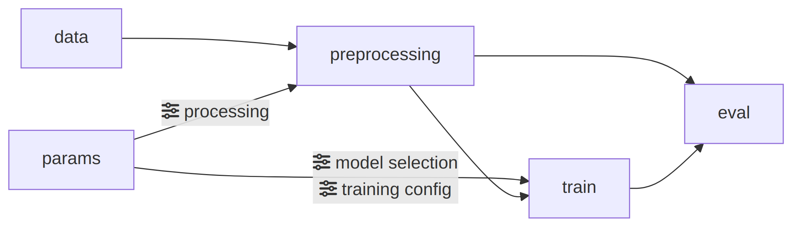{ width=80% }

```python
X, Y = preprocessing(data, params)
model = select_model(params)
model.train(X, Y, params)
metrics = model.eval(X, Y)
```

\framebreak

We start doing Hyper Parameter Optimization (HPO):

{ width=50% }

Neat and lovely, warm and cuddly, right?  
But let's see what can get challenging.

### <i class="fa fa-sliders"></i> Complexity: Hyper Parameters {.allowframebreaks}

::: {.columns .onlytextwidth}
::: {.column width="45%"}

Even for a simple supervised setting, we quickly branch into many variants (`p`,
`m` and `n` are hyper-params for data pre-processing, models, and training
respectively).
:::

::: {.column width="55%"}
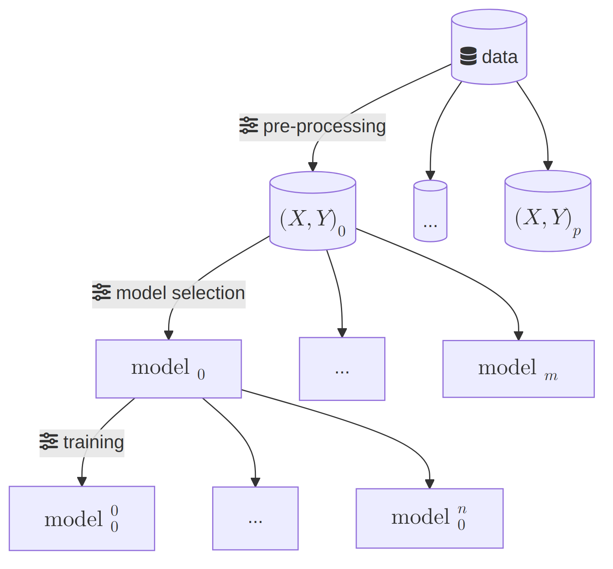{ width=\linewidth }
:::
:::

\framebreak

Let's simplify that to (with `p * m * n` total variations):

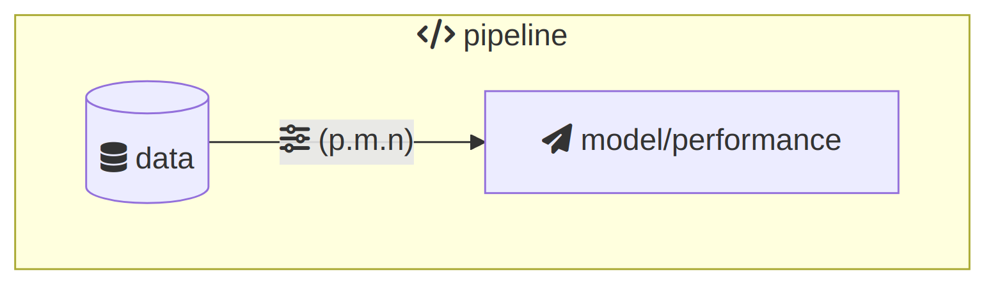{ width=50% }

**The "next Day/Week/Month" problem: auditability and reproducibility**

We want to log/tag certain outputs (plots, tables, etc.) representing
performance measures and params.

\framebreak

We would assume the green path produced our "tagged" results:

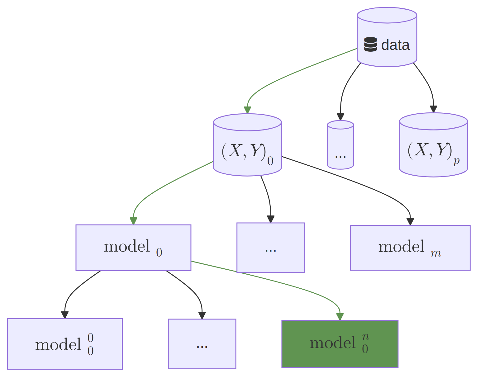{ width=50% }

\framebreak

But how do we know we didn't make a mistake and its not actually the red ones?

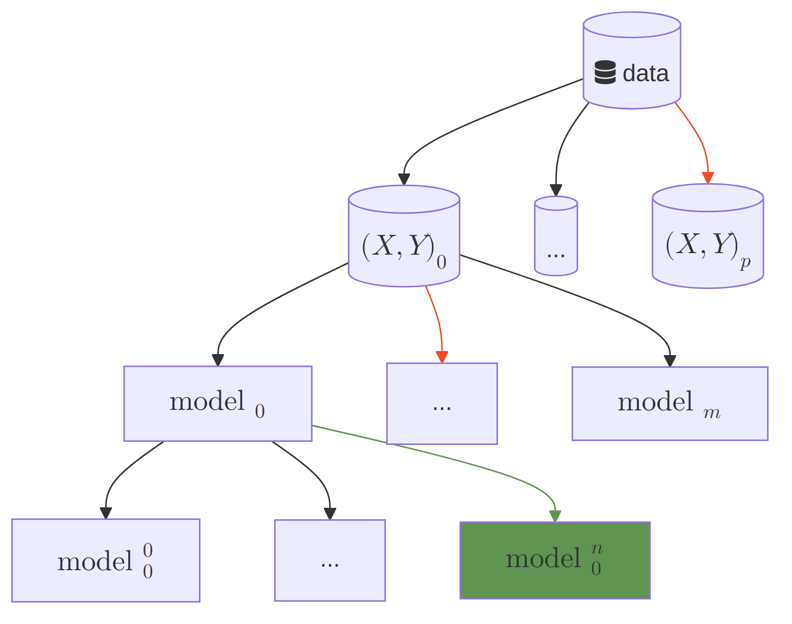{ width=50% }

\framebreak

How do we know we got that right?

- Do we have a way to "audit" and show/prove what exact config did that result
  come from? Or is it implicit by the last values in the code?
- Can we **easily and reliably** trigger the whole pipeline to reproduce the
  same result, or did we hard code stuff?

_Simple solution:_ all configs in a single place (**one source of truth**), and
store the configs along the results.

- Not easy in practice, if the run-time execution could be **non-linear** or
  without a proper **cache invalidation** (as is typical with jupyter
  notebooks).

### <i class="fa fa-code"></i> Complexity: Implementation changes

Certain function's implementation changes that causes different results and is
not explicitly noted in the configs.

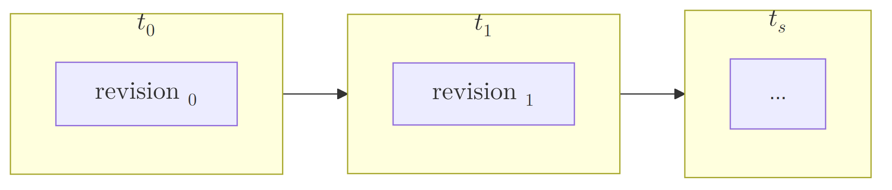{ width=70% }

Let's update our model simplification with `s` for "source code":

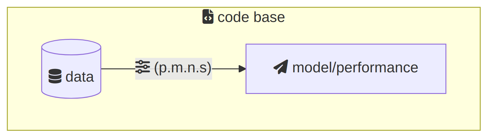{ width=50% }

_Simple solution:_ log the git commit hash along with the results (not
bullet-proof, but can mitigate a lot of issues).

### <i class="fa fa-database"></i> Complexity: Data can evolve over time {.allowframebreaks}

Data changes over time, assumptions update, domain knowledge improve, etc. We
started with `<X0, Y0>` at `[t0]`, followed by updates to `X` and `Y` over time.

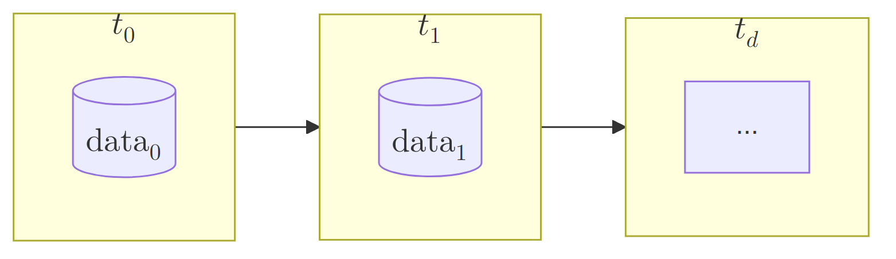{ width=40% }

Let's update our model simplification with `d` for data:

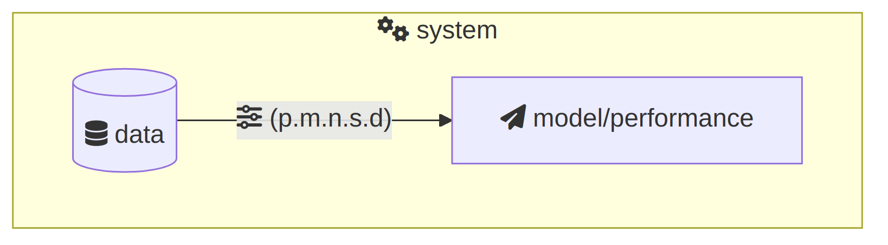{ width=50% }

_Simple solution:_ data versioning.

### <i class="fa fa-bookmark"></i> Complexity: Research and ideas {.allowframebreaks}

::: {.columns .onlytextwidth}
::: {.column width="50%"}
Sometimes the bigger system is a composition of multiple different models.
We'll have to maintain multiple pipelines if they are not a unified model.

- Now we have to deal with complexity at each level.

---

Let's update our model simplification with `r` for "research and ideas":

{ width=\linewidth }

:::

::: {.column width="50%"}
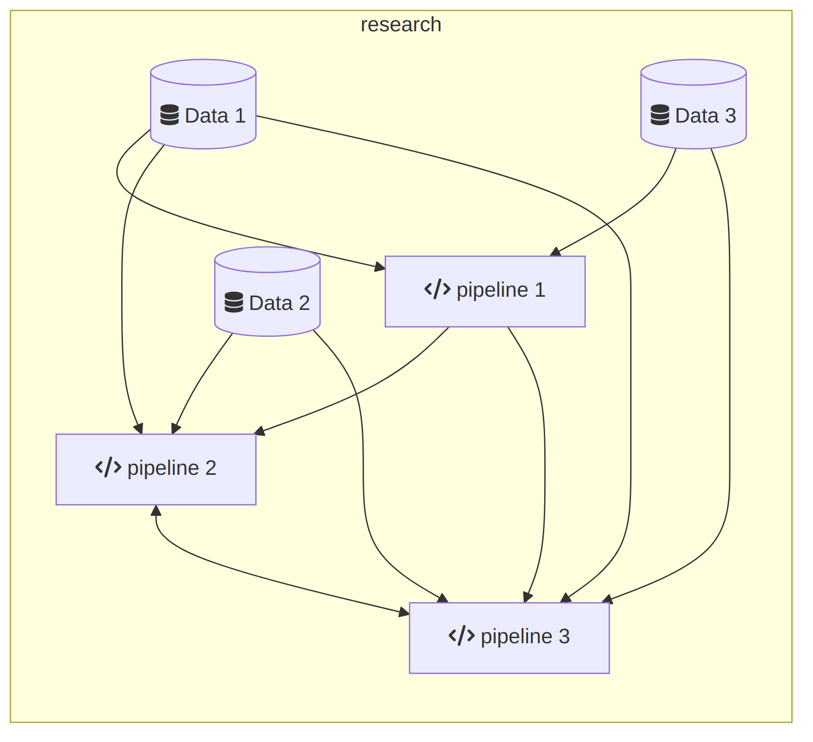{ width=\linewidth }
:::
:::

### <i class="fa fa-people-group"></i> Complexity: Team work, communication, onboarding, documentation {.allowframebreaks}

People moving between projects, projects influencing each other, and the cost of
missing shared conventions.

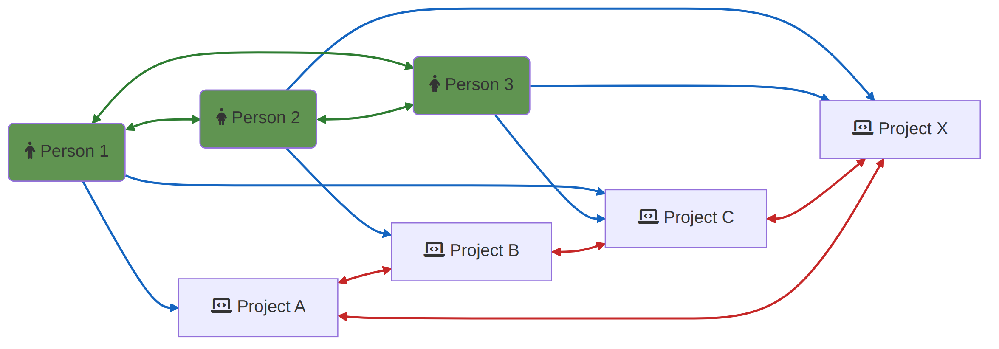

OK, this is getting out of hand (`t` for "team-work")!

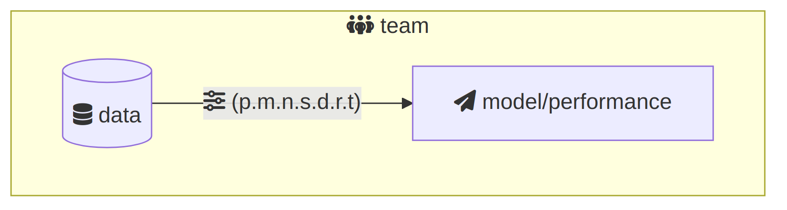{ width=50% }

**"simple solution"**:

- documentation
- clean and maintainable code
- reproducible experiments
- ...  

but, _we are way out of ML-specific realm, this is partly general team work and
partly general software practices!_

### More levels and dimensions {.allowframebreaks}

The story so far was "inside the ML bubble" (params, code, data, research, team).
In real projects, more dimensions show up:

* deployment
* big data
* distributed training
* heterogeneous systems
* optimization and constraints
* database and service integration
* ...

\framebreak

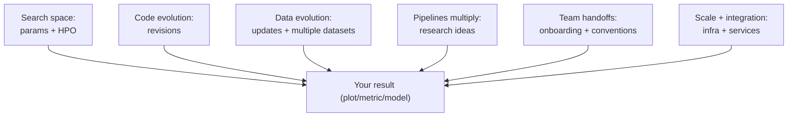

These "dimensions" are present everywhere. We need a mental model that helps us
recognize them early, and handle them intentionally.

### No ring, but a coordinate system {.allowframebreaks}

**Bad news:**

* There is no single way of handling every complexity. There are trade-offs.

**Good news:**

* We almost never have to deal with all complexities at once.
* A small toolset can cover a large part of the pain, if we make "the hidden
  coordinates" explicit.

\framebreak

::: {.columns .onlytextwidth}
::: {.column width="50%"}
A result (a plot, a metric, a "best run") should be locatable by a few
coordinates:

* data snapshot
* code snapshot
* config/params
* environment
* pipeline execution
:::

::: {.column width="50%"}
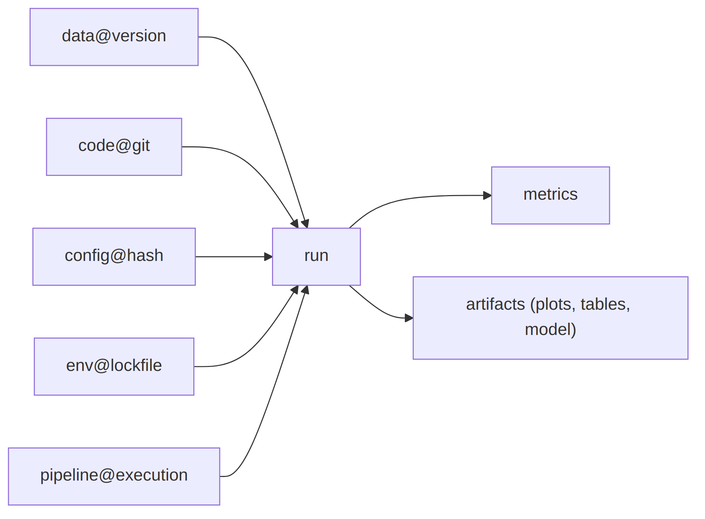{ width=\linewidth }
:::
:::

If we cannot point to these coordinates quickly, we do not really have a result
we can defend.

## Tooling and Ecosystem

### <i class="fa fa-toolbox"></i> Why tooling

Two questions:

* Which exact run produced this plot?
* Can you reproduce it today, on a clean machine, without manual steps?

If the honest answer is "not sure", then the problem is not the model.
The problem is that the work is not *trackable*.

Tooling is how we turn:

* "I think I did this" -> "I can show exactly what I did"
* "best run somewhere on my laptop" -> "best run is findable and reproducible"
* "handoffs break" -> "handoffs are boring"

### <i class="fa fa-ban"></i> Why ML projects fail to be reproducible {.allowframebreaks}

::: {.columns .onlytextwidth}
::: {.column width="50%"}
The usual culprits are not exotic. They are invisible.

* hidden data versions
* hidden configs
* invisible code changes
* notebook state and non-linear execution
* environment drift

When this happens:

* "best run" cannot be found
* "best run" cannot be reproduced
* person-to-person and paper-to-paper handoffs break
:::

::: {.column width="50%"}
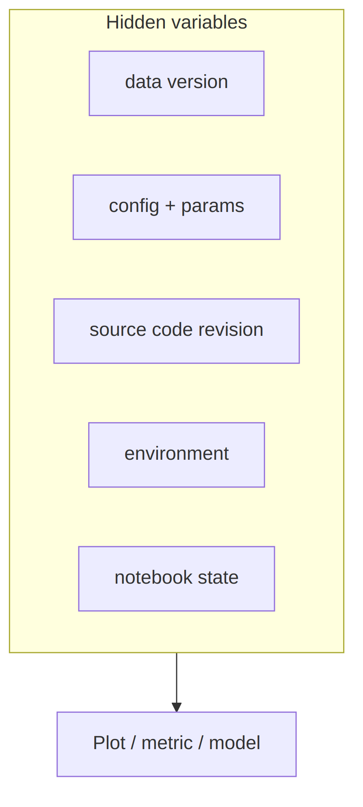{ width=\linewidth }
:::
:::

### <i class="fa fa-map"></i> Ecosystem map (pragmatic, not exhaustive) {.allowframebreaks}

We do not need a giant framework. We need a small set of tools that make the
hidden coordinates explicit, and keep them connected.

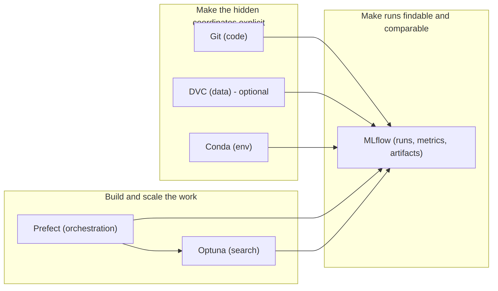{ width=60% }

\framebreak

What each tool covers (and what it does not):

* Git: code history (not data snapshots, not runs)
* DVC (guided tour): data snapshots (not an experiment tracker)
* MLflow (guided build): runs, metrics, artifacts, provenance (not
  orchestration, not HPO)
* Optuna (guided build): HPO/search and study analysis (not reproducibility by
  itself)
* Prefect (guided tour): orchestration, retries, scheduling patterns (not
  tracking unless you log)

Alternatives exist in every box (see next slide).  
We pick this set because it is simple, script-friendly, and covers a lot of the
pain quickly.

### Ecosystem: categories and what they answer (quick glance) {.shrink}

We can explain the tooling ecosystem via a small set of categories.  
Each category answers a different question, and has a recognizable set of
capabilities.

**Putting it together (the short memory aid)**

* Versioning answers: "Which data/code snapshot did we use?"
* Tracking answers: "Which run produced this result?"
* Optimization answers: "How did we search for better configs?"
* Orchestration answers: "How do we run this reliably and repeatedly?"

**Or as a boundary**

* Training frameworks help you write training loops faster.
* Trackers record what happened.
* Orchestrators make it repeatable and robust.
* Optimizers search the space.
* Versioning tools make data/code snapshots explicit.

### Ecosystem: categories and what they answer - matrix (quick glance)


### Prominent alternatives by category (quick glance) {.shrink}

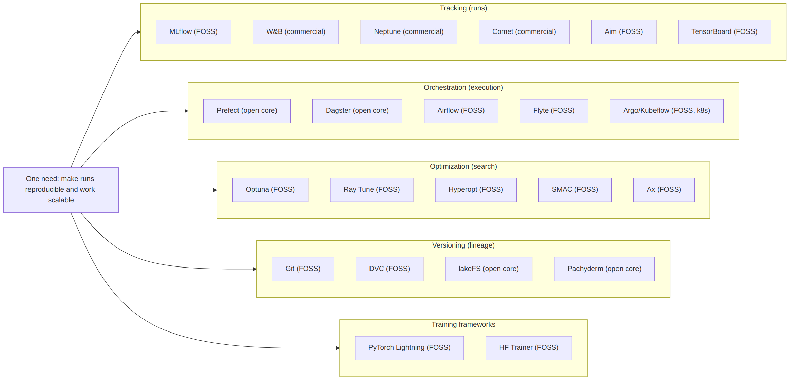

### Prominent alternatives by category (quick glance) {.shrink}

+----------------------------------------------------+---------------------------------------------------------------+
| Category                                           | Tools                                                         |
+====================================================+===============================================================+
| Tracking (runs, metrics, artifacts)                | * MLflow (FOSS)                                               |
|                                                    | * Weights and Biases (commercial, free tier)                  |
|                                                    | * Neptune (commercial, free tier)                             |
|                                                    | * Comet (commercial, free tier)                               |
|                                                    | * Aim (FOSS)                                                  |
|                                                    | * TensorBoard (FOSS, strongest in TF ecosystems)              |
+----------------------------------------------------+---------------------------------------------------------------+
| Orchestration (pipelines, retries, scheduling)     | * Prefect (open source core)                                  |
|                                                    | * Dagster (open source core)                                  |
|                                                    | * Apache Airflow (FOSS)                                       |
|                                                    | * Flyte (FOSS)                                                |
|                                                    | * Argo Workflows / Kubeflow Pipelines (FOSS, Kubernetes-first)|
+----------------------------------------------------+---------------------------------------------------------------+
| Optimization (HPO, search, schedulers)             | * Optuna (FOSS)                                               |
|                                                    | * Ray Tune (FOSS)                                             |
|                                                    | * Hyperopt (FOSS)                                             |
|                                                    | * SMAC (FOSS)                                                 |
|                                                    | * Ax (FOSS)                                                   |
|                                                    | * Nevergrad (FOSS)                                            |
+----------------------------------------------------+---------------------------------------------------------------+
| Versioning and lineage (data, pipelines, artifacts)| * DVC (FOSS)                                                  |
|                                                    | * lakeFS (open core)                                          |
|                                                    | * Pachyderm (open core)                                       |
|                                                    | * git-annex (FOSS)                                            |
+----------------------------------------------------+---------------------------------------------------------------+
| Training loop frameworks (not tracking, not        | * PyTorch Lightning (FOSS)                                    |
| orchestration)                                     | * Hugging Face Trainer (FOSS)                                 |
|                                                    | * Keras/TensorFlow high-level APIs (FOSS)                     |
|                                                    | * skorch (FOSS)                                               |
+----------------------------------------------------+---------------------------------------------------------------+

### Tool comparison matrix (quick glance) {.shrink}


### Tool selection example: Experiment Tracking (quick glance) {.shrink}

| Tool | Best at | Trade-offs | Cost / license |
| --- | --- | --- | --- |
| MLflow | run tracking, artifacts, provenance, self-host, script-friendly | UI less polished, collaboration features lighter | FOSS |
| W&B | UX, collaboration, dashboards, artifacts, team workflows | SaaS dependency for most users, costs for teams/scale | Commercial (free tier) |
| TensorBoard | training visualization (scalars/graphs), simple logging | not a full tracker, weak provenance/compare by itself | FOSS |

### Tool selection example: Orchestration (quick glance) {.shrink}

| Tool | Best at | Trade-offs | Infra vibe |
| --- | --- | --- | --- |
| Prefect | pythonic workflows, quick adoption, retries, caching, scheduling | less "data-asset" centric than Dagster | light to medium |
| Dagster | assets/lineage, strong structure, great dev experience | steeper concepts, more opinionated | medium |
| Airflow | stable scheduling, huge ecosystem, classic DAG ETL | heavier, more boilerplate, not great for dynamic workflows | medium to heavy |
| Argo / KFP | Kubernetes-native pipelines, container-first scale | requires k8s maturity, more ops | heavy (k8s-first) |

### Tool selection example: HPO (quick glance) {.shrink}

| Tool | Best at | Trade-offs | Scaling |
| --- | --- | --- | --- |
| Optuna | lightweight HPO, pruning, great ergonomics | less "cluster-native" out of the box | single-node to modest |
| Ray Tune | distributed tuning, large-scale parallel trials | more infra and concepts (Ray) | cluster-first |

## Recap

### These are not "industry-only requirements" {.shrink}

We often assume certain tools, concerns, or discipline are irrelevant due to a false dichotomy:

**"academic research" vs "industrial development"**

Many of these are just ways-of-working under constraints, intended to optimize quality, throughput, and credibility.
But guess where else these tricks can help?

| Concern | Sounds like | In practice it also means |
| --- | --- | --- |
| quality code | "product engineering" | research that survives handoffs and revision cycles |
| bigger data | "industry scale" | problems solvable beyond current scope |
| reproducibility and auditability | "regulation paperwork" | credible research claims and easier peer review |
| collaboration tooling | "company management" | major throughput boost (we cannot do it alone) |
| higher complexity and constraints | "real-world mess" | high-impact research questions become feasible |
| real-world metrics | "customer KPIs" | evaluation that matches the real objective |
| real-world integration | "business concerns" | research that can transition and live longer |

### Take away {.shrink}

None of this is new: you have seen it, suffered it, and learned to cope with it.
But:

* Has it ever caused you to **limit the scope of your work**?
* Have you ever reached a point where you were **not sure about the result**?
* Have you ever had the "result" (plots) but **could not replicate** it despite your best housekeeping? (notebook / folders / Excel)

**Has this complexity ever limited what you considered achievable?**

One might say:

* "my data is super small, I do not care about challenges of bigger data"
* "I am a researcher, I do not care about deployment and delivering a service"
* "in academia knowledge (paper) is our output and not product (code), so code quality doesn't matter"

One should consider

* We live in the world we define and build
* those boundaries are blurrier than we think
* many practices are just to help us work better, not specific to academia or industry

So: **let's stop letting hidden complexity silently define our boundaries.**

And Remember:

- **If we cannot locate the run, we cannot build on it.**
- **Make work locatable, then make progress faster.**
